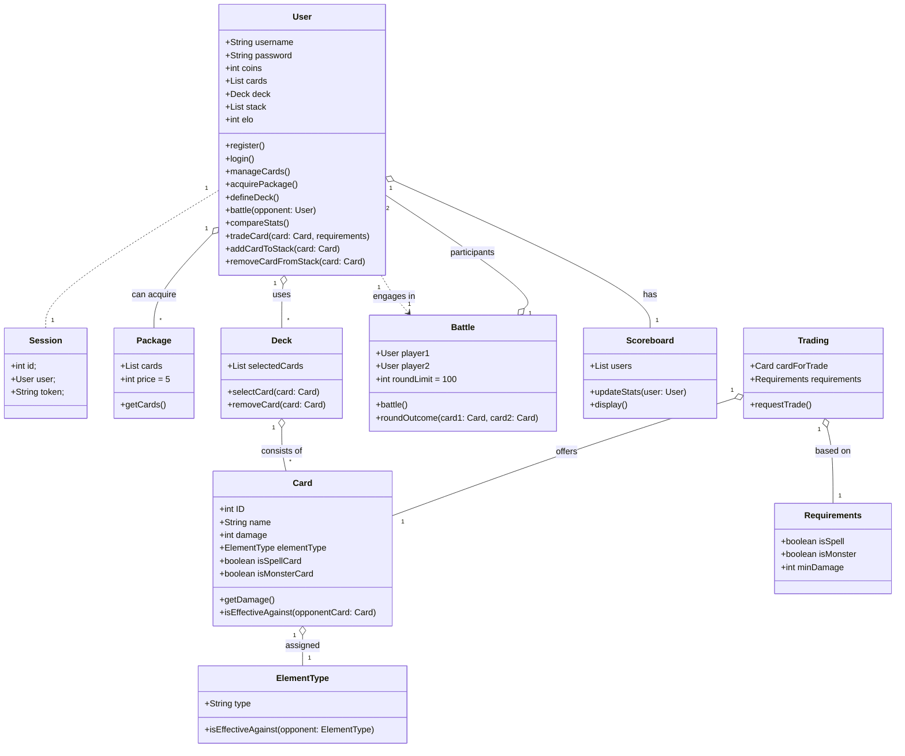

# Structure

├── main\
│  ├── java\
│  │  └── at\
│  │      └── technikum\
│  │          ├── api\
│  │          │  ├── controller\
│  │          │  │  ├── Controller.java\
│  │          │  │  ├── SessionController.java\
│  │          │  │  └── UserController.java\
│  │          │  └── info.txt\
│  │          ├── DAL\
│  │          │  ├── CardData.java\
│  │          │  ├── DAO\
│  │          │  │  ├── Card.java\
│  │          │  │  └── User.java\
│  │          │  ├── SessionData.java\
│  │          │  └── UserData.java\
│  │          ├── httpserver\
│  │          │  ├── http\
│  │          │  │  ├── ContentType.java\
│  │          │  │  ├── HttpStatus.java\
│  │          │  │  └── Method.java\
│  │          │  ├── server\
│  │          │  │  ├── HeaderMap.java\
│  │          │  │  ├── Request.java\
│  │          │  │  ├── Response.java\
│  │          │  │  ├── Server.java\
│  │          │  │  ├── Service.java\
│  │          │  │  └── Session.java\
│  │          │  └── utils\
│  │          │      ├── RequestBuilder.java\
│  │          │      ├── RequestHandler.java\
│  │          │      └── Router.java\
│  │          ├── Main.java\
│  │          └── service\
│  │              ├── SessionService.java\
│  │              └── UserService.java\
│  └── resources\
└── test\
    └── java

# Class diagram:
